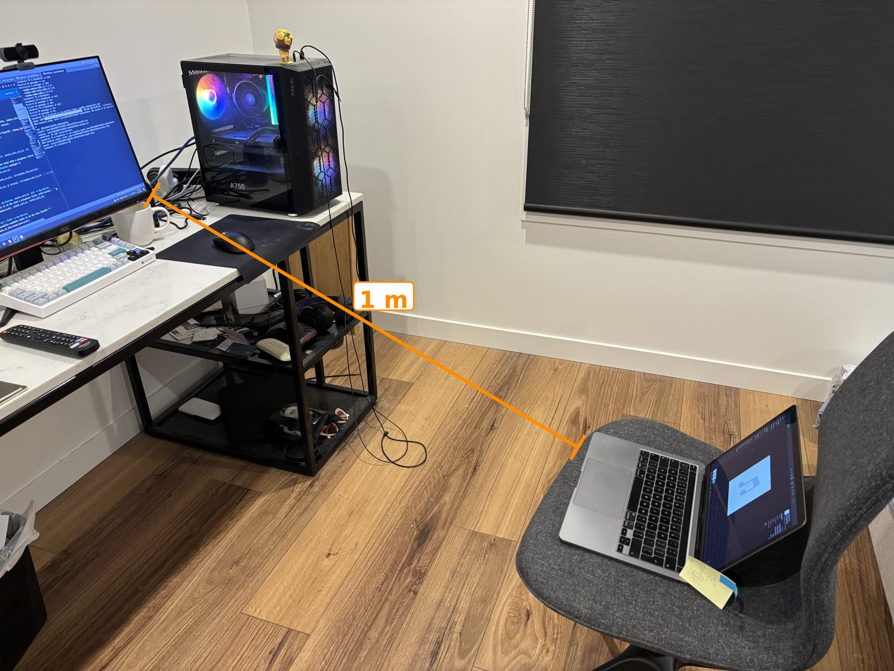

# EarBench

Can a robot hear older people in a noisy aged-care lounge? I built EarBench to find out.

**Demo:** https://earbench.hydra5120.workers.dev/



## What it does

It takes 100 clips of Australian speakers from Common Voice (50 aged 60+, 50 aged 20 to 49). It plays them through a simulated room at 1, 2 and 3 m from the mic, mixes in TV, kitchen, living-room or cafeteria noise, and transcribes them with Whisper (tiny, base and small). Then it scores the word error rate for each condition, with 95% confidence intervals.

I also ran it for real in my lounge room. A MacBook played the clips, a PC webcam recorded them, and the TV was on in the background.

## What I found

- **The TV breaks it.** With the TV 10 dB quieter than the speaker at 2 m, Whisper small got only 8% of older speakers' clips usable (under 20% word error). Most errors weren't missed words. It looped phrases or made things up, like "please subscribe".
- **Even quiet rooms aren't great.** With no noise at 2 m, 72% of older speakers' clips were usable.
- **The simulation didn't match my real room.** It was too harsh at 1 m, and it underestimated how badly the real room failed with the TV on at 2 to 3 m.
- **Older and younger speakers scored about the same.** But most of the "older" speakers are in their sixties, younger than most aged-care residents.

## Run it

```bash
uv sync
uv run pytest                                          # no datasets needed
uv run earbench prepare --config configs/prepare.yaml
uv run earbench sweep --config configs/quick.yaml
uv run earbench report runs/<run_id>
```

You need Common Voice 26.0 (Australian English) and the DEMAND noise set. Neither is included.

## Limits

One real room, one mic, one TV recording, and only Whisper. A real robot's mic and speech pipeline would behave differently. The full protocol and results are in `docs/`.

## Credits

Common Voice (CC0), DEMAND (CC BY-SA 3.0), Whisper (MIT).
